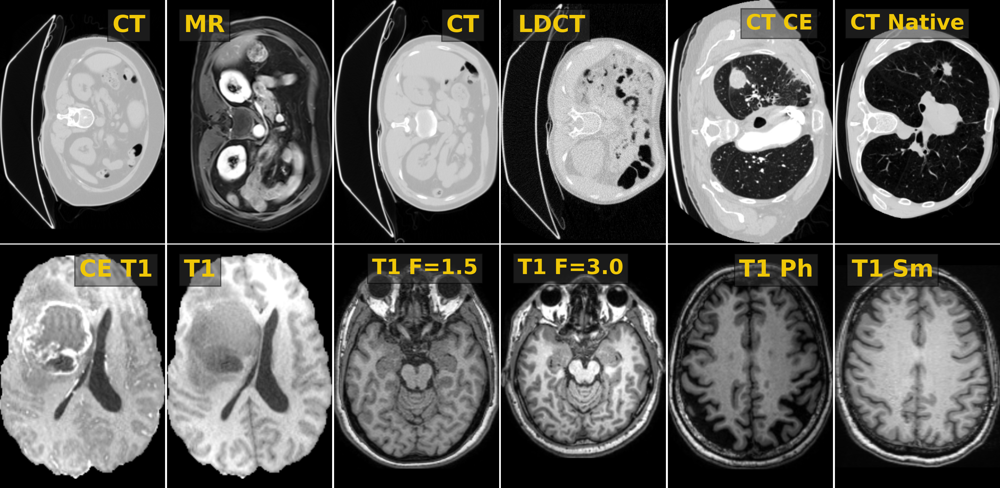

# M3DA

This repository contains the code and supplementary materials for the paper

**M3DA: Benchmark for Unsupervised Domain Adaptation in 3D Medical Image Segmentation**

Domain shift remains a critical obstacle in applying Deep Learning to segment 3D medical images like MRI and CT.
To address this, we introduce the M3DA benchmark, featuring four public datasets with diverse and realistic domain shifts.
Evaluating more than ten existing domain adaptation methods, we find none fully bridge the performance gap, underlining the need for new approaches to improve model robustness in medical imaging.

Examples from individual domains in M3DA for visual comparison between domains:




## Install

```
git clone https://github.com/MICCAI2025Paper4631/M3DA.git
cd M3DA && pip install -e .
```

## Getting started

### 1. Downloading data

We use four source datasets in our benchmark: AMOS, BraTS2021, CC359, and LIDC.
As a unifying interface to access the data, we use [AMID](https://github.com/neuro-ml/amid/),
so you can follow the guides on data downloading from the latter lib:

- Download instruction for the [AMOS dataset](documentation/download_amos.md)
- Download instruction for the [BraTS2021 dataset](documentation/download_brats2021.md)
- Download instruction for the [CC359 dataset](documentation/download_cc359.md)
- Download instruction for the [LIDC dataset](documentation/download_lidc.md)
- Download instruction for the [AMOS LDCT dataset](documentation/download_amos_ldct.md)

### 2. Configuring repo

Insert paths to the raw datasets (downloaded at the previous step) in [m3da/config.py](m3da/config.py), e.g.,
```
PATH_AMOS22_RAW = "/path/to/the/downloaded/files/amos22/"
# etc.
```

### 3. Importing and using datasets

Every DA task has five primary objects:

1. **dataset class instance**: `dataset_*`. 
This instance has methods `image` and `mask` to get 3D image and the corresponding segmentation mask items.

2. **tuple with the task split**: `split_*`.
All splits are organized as `[source_ids: list, target_train_ids: list, target_test_ids: list]`.

3. **tuple with labels**: `labels_*`. It enumerates all segmentation classes in the selected task.
For instance, CC359 has a background and three foreground classes to segment, so `labels_t1f = (0, 1, 2, 3)`.

4. **int indicating the background label**: `background_lbl_*`.
This item explicitly indicates what label corresponds to the background. For now, it is always `0`.

5. **tuple with recommended spacing**: `spacing_*`.
Here, we provide the recommended spacing for the (optional) preprocessing step of image resampling.

Every DA task also has three secondary objects required for the oracle setup:

6. **dataset class instance**: `dataset_*_oralce`. Similar dataset, but if one needs to train an oracle model.

7. **tuple with the oracle split**: `split_*_oracle`. It contains a set of splits as above
in order to cover all available data via cross-validation.
These splits are organized as `[[target_train_ids_val0: list, target_test_ids_val0: list], ...]`.

8. **tuple with recommended spacing**: `spacing_*_oracle`.

#### Usage example:

```
from m3da.bench.task06_t1f import dataset_t1f, split_t1f, labels_t1f, background_lbl_t1f

x_source = dataset_t1f.image(split_t1f[0][0])
y_source = dataset_t1f.mask(split_t1f[0][0])

x_target_train = dataset_t1f.image(split_t1f[1][0])
# y_target_train = dataset_t1f.mask(split_t1f[1][0])  # (not needed in UDA setup, but sometimes available)

x_target_test = dataset_t1f.image(split_t1f[2][0])
y_target_test = dataset_t1f.mask(split_t1f[2][0])  # (for testing purposes only)
```

## Results


| Method         | MR→CT  | CT→MR  | CT→LDCT | CECT→CT | T1CE→T1 | T1 F   | T1 Sc  | T1Mix | avg DSC | avg gap |
|----------------|--------|--------|---------|---------|---------|--------|--------|-------|---------|---------|
| **Baseline**   | 0.032  | 0.032  | 0.133   | 0.228   | 0.426   | 0.741  | 0.766  | 0.560 | 0.365   | 0.0%    |
| **HM**         | 0.331  | 0.222  | 0.111   | 0.133   | 0.341   | 0.789  | 0.748  | 0.504 | 0.397   | -1.1%   |
| **CycleGAN 3D**| 0.333  | 0.264  | 0.326   | 0.130   | 0.345   | 0.791  | 0.713  | 0.762 | 0.458   | 9.5%    |
| **MinEnt**     | 0.140  | 0.172  | 0.505   | 0.392   | 0.429   | 0.770  | 0.798  | 0.776 | 0.498   | 28.5%   |
| **CycleGAN 2D**| 0.205  | 0.406  | 0.530   | 0.216   | 0.398   | 0.852  | 0.801  | 0.795 | 0.525   | 30.2%   |
| **GIN**        | 0.589  | 0.637  | 0.722   | 0.163   | 0.382   | 0.837  | 0.709  | 0.804 | 0.605   | 33.6%   |
| **AdaBN**      | 0.322  | 0.353  | 0.587   | 0.295   | 0.433   | 0.778  | 0.833  | 0.796 | 0.550   | 35.0%   |
| **DANN**       | 0.296  | 0.278  | 0.699   | 0.409   | 0.416   | 0.730  | 0.833  | 0.776 | 0.555   | 36.2%   |
| **IN**         | 0.303  | 0.308  | 0.668   | 0.427   | 0.428   | 0.756  | 0.838  | 0.784 | 0.564   | 39.6%   |
| **MIND**       | 0.560  | 0.588  | 0.237   | 0.425   | 0.335   | 0.865  | 0.869  | 0.845 | 0.590   | 45.9%   |
| **Gamma**      | 0.349  | 0.166  | 0.241   | 0.441   | 0.443   | 0.893  | 0.910  | 0.910 | 0.544   | 48.3%   |
| **SE**         | 0.391  | 0.388  | 0.603   | 0.332   | 0.388   | 0.906  | 0.893  | 0.918 | 0.602   | 51.7%   |
| **nnAugm**     | 0.166  | 0.102  | 0.779   | 0.392   | 0.446   | 0.910  | 0.897  | 0.889 | 0.573   | 51.9%   |
| **Oracle**     | 0.842  | 0.826  | 0.814   | 0.519   | 0.686   | 0.954  | 0.957  | 0.958 | 0.820   | 100.0%  |

The qualitative results for domain and method pairs can be visually evaluated below:


## Contact
